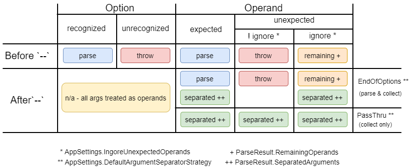

# Argument Separator

The argument separater `--` has been adopted by various tools to serve two different strategies: [end-of-options indicator](#end-of-options-indicator) and [pass-thru arguments](#pass-thru-arguments).

Use `AppSettings.Parser.DefaultArgumentSeparatorStrategy` to specify which strategy to use.

The default is `EndOfOptions` so that by default users have it as a fallback to enter any value as an operand.

The strategy can be changed for a command using the `Command` attribute: `[Command(ArgumentSeparatorStrategy=ArgumentSeparatorStrategy.PassThru)]`.

We recommend leaving the default as `EndOfOptions` and overriding on the `Command` when you have a command that expects to receive arguments to pass thru to another process.

## End of Options Indicator

[Posix guideline (#10)](https://pubs.opengroup.org/onlinepubs/9699919799/basedefs/V1_chap12.html#tag_12_02) 

> The first -- argument that is not an option-argument should be accepted as a delimiter indicating the end of options. Any following arguments should be treated as operands, even if they begin with the '-' character.

This convention was created to handle cases where operand values begin with `-` or `--` causing the parser to interpret them as options.

All operands after the first ` -- ` will be stored in `CommandContext.ParseResult.SeparatedArguments` regardless of whether they were expected or not.

Let's look at an example.

<!-- snippet: argument_separator_end_of_options -->
<a id='snippet-argument_separator_end_of_options'></a>
```c#
public void EndOfOptions(IConsole console, CommandContext ctx, string? arg1)
{
    var parserSettings = ctx.AppConfig.AppSettings.Parser;
    console.WriteLine("IgnoreUnexpectedOperands: " + 
                      parserSettings.IgnoreUnexpectedOperands);
    console.WriteLine("DefaultArgumentSeparatorStrategy: " + 
                      parserSettings.DefaultArgumentSeparatorStrategy);
    console.WriteLine();
    console.WriteLine($"arg1: {arg1}");
    console.WriteLine($"separated: {string.Join(',', ctx.ParseResult!.SeparatedArguments)}");
    console.WriteLine($"remaining: {string.Join(',', ctx.ParseResult!.RemainingOperands)}");
}
```
<sup><a href='https://github.com/bilal-fazlani/commanddotnet/blob/master/CommandDotNet.DocExamples/Arguments/Values/Argument_Separator.cs#L20-L33' title='Snippet source file'>snippet source</a> | <a href='#snippet-argument_separator_end_of_options' title='Start of snippet'>anchor</a></sup>
<!-- endSnippet -->

This command expects a single operand, but if the operand value looks like an option, the parser will throw an exception

<!-- snippet: argument_separator_end_of_options_option_mask_no_separator -->
<a id='snippet-argument_separator_end_of_options_option_mask_no_separator'></a>
```bash
$ example.exe EndOfOptions --option-mask
Unrecognized option '--option-mask'

Usage: example.exe EndOfOptions [<arg1>]

Arguments:

  arg1  <TEXT>
```
<sup><a href='https://github.com/bilal-fazlani/commanddotnet/blob/master/CommandDotNet.DocExamples/BashSnippets/argument_separator_end_of_options_option_mask_no_separator.bash#L1-L10' title='Snippet source file'>snippet source</a> | <a href='#snippet-argument_separator_end_of_options_option_mask_no_separator' title='Start of snippet'>anchor</a></sup>
<!-- endSnippet -->

But if we put the separator before the operand value, the parser will interpret the value as an operand

<!-- snippet: argument_separator_end_of_options_option_mask_separator -->
<a id='snippet-argument_separator_end_of_options_option_mask_separator'></a>
```bash
$ example.exe EndOfOptions -- --option-mask
IgnoreUnexpectedOperands: False
DefaultArgumentSeparatorStrategy: EndOfOptions

arg1: --option-mask
separated: --option-mask
remaining:
```
<sup><a href='https://github.com/bilal-fazlani/commanddotnet/blob/master/CommandDotNet.DocExamples/BashSnippets/argument_separator_end_of_options_option_mask_separator.bash#L1-L9' title='Snippet source file'>snippet source</a> | <a href='#snippet-argument_separator_end_of_options_option_mask_separator' title='Start of snippet'>anchor</a></sup>
<!-- endSnippet -->


Separated operands are available in `CommandContext.ParseResult.SeparatedArguments`

## Unexpected Operands

Unexpected operands occur when there are no longer operands to assign values to. This will result in a parsing exception. Using the EndOfOptions command from above...

<!-- snippet: argument_separator_end_of_options_unexpected_operand -->
<a id='snippet-argument_separator_end_of_options_unexpected_operand'></a>
```bash
$ example.exe EndOfOptions expected unexpected
Unrecognized command or argument 'unexpected'

Usage: example.exe EndOfOptions [<arg1>]

Arguments:

  arg1  <TEXT>
```
<sup><a href='https://github.com/bilal-fazlani/commanddotnet/blob/master/CommandDotNet.DocExamples/BashSnippets/argument_separator_end_of_options_unexpected_operand.bash#L1-L10' title='Snippet source file'>snippet source</a> | <a href='#snippet-argument_separator_end_of_options_unexpected_operand' title='Start of snippet'>anchor</a></sup>
<!-- endSnippet -->

set `AppSettings.Parser.IgnoreUnexpectedOperands = true` or `[Command(IgnoreUnexpectedOperands = true)]` to ignore unexpected operands.

<!-- snippet: argument_separator_end_of_options_unexpected_operand_ignored -->
<a id='snippet-argument_separator_end_of_options_unexpected_operand_ignored'></a>
```bash
$ example.exe EndOfOptions expected unexpected
IgnoreUnexpectedOperands: True
DefaultArgumentSeparatorStrategy: EndOfOptions

arg1: expected
separated: 
remaining: unexpected
```
<sup><a href='https://github.com/bilal-fazlani/commanddotnet/blob/master/CommandDotNet.DocExamples/BashSnippets/argument_separator_end_of_options_unexpected_operand_ignored.bash#L1-L9' title='Snippet source file'>snippet source</a> | <a href='#snippet-argument_separator_end_of_options_unexpected_operand_ignored' title='Start of snippet'>anchor</a></sup>
<!-- endSnippet -->

Unexpected operands are available in `CommandContext.ParseResult.RemainingOperands`

## Pass-thru arguments

While the Posix guideline specifies the `--` should be used as an end-of-options indicator, there's a common pattern
to use `--` to denote arguments to be passed to a sub-process. 

For example, [dotnet.exe](https://docs.microsoft.com/en-us/dotnet/core/tools/dotnet-run#options) has this discription for `--`:

> Delimits arguments to dotnet run from arguments for the application being run. All arguments after this delimiter are passed to the application run.

Let's modify the EndOfOptions example using the `[Command]` attribute to set the `ArgumentSeparatorStrategy` and `IgnoreUnexpectedOperands`

<!-- snippet: argument_separator_pass_thru -->
<a id='snippet-argument_separator_pass_thru'></a>
```c#
[Command(ArgumentSeparatorStrategy = ArgumentSeparatorStrategy.PassThru)]
public void PassThru(IConsole console, CommandContext ctx, string? arg1)
{
    var parserSettings = ctx.AppConfig.AppSettings.Parser;
    console.WriteLine("IgnoreUnexpectedOperands: " +
                      parserSettings.IgnoreUnexpectedOperands);
    console.WriteLine("DefaultArgumentSeparatorStrategy: " +
                      parserSettings.DefaultArgumentSeparatorStrategy);
    console.WriteLine();
    console.WriteLine($"arg1: {arg1}");
    console.WriteLine($"separated: {string.Join(',', ctx.ParseResult!.SeparatedArguments)}");
    console.WriteLine($"remaining: {string.Join(',', ctx.ParseResult!.RemainingOperands)}");
}
```
<sup><a href='https://github.com/bilal-fazlani/commanddotnet/blob/master/CommandDotNet.DocExamples/Arguments/Values/Argument_Separator.cs#L35-L49' title='Snippet source file'>snippet source</a> | <a href='#snippet-argument_separator_pass_thru' title='Start of snippet'>anchor</a></sup>
<!-- endSnippet -->

Help will append ` [[--] <arg>...]` to the usage example when `ArgumentSeparatorStrategy.PassThru` is used.

<!-- snippet: argument_separator_pass_thru_help -->
<a id='snippet-argument_separator_pass_thru_help'></a>
```bash
$ example.exe PassThru -h
Usage: example.exe PassThru [<arg1>] [[--] <arg>...]

Arguments:

  arg1  <TEXT>
```
<sup><a href='https://github.com/bilal-fazlani/commanddotnet/blob/master/CommandDotNet.DocExamples/BashSnippets/argument_separator_pass_thru_help.bash#L1-L8' title='Snippet source file'>snippet source</a> | <a href='#snippet-argument_separator_pass_thru_help' title='Start of snippet'>anchor</a></sup>
<!-- endSnippet -->

Here is how an unexpected arg is processed with the separator

<!-- snippet: argument_separator_pass_thru_option_mask_separator -->
<a id='snippet-argument_separator_pass_thru_option_mask_separator'></a>
```bash
$ example.exe PassThru expected -- pass-thru
IgnoreUnexpectedOperands: False
DefaultArgumentSeparatorStrategy: EndOfOptions

arg1: expected
separated: pass-thru
remaining:
```
<sup><a href='https://github.com/bilal-fazlani/commanddotnet/blob/master/CommandDotNet.DocExamples/BashSnippets/argument_separator_pass_thru_option_mask_separator.bash#L1-L9' title='Snippet source file'>snippet source</a> | <a href='#snippet-argument_separator_pass_thru_option_mask_separator' title='Start of snippet'>anchor</a></sup>
<!-- endSnippet -->

## How to support both?

Explicit support for both concepts is complicated to provide generically because the framework cannot know

* if a operands for a given command can be formatted like options or directives
* if a command can expect pass-thru arguments 
* if a user entered `--` to indicate end-of-options or pass-thru arguments

Due to this complexity, we'll give you the data and let you determine the best approach based on the requirements of the command.

## Argument Parsing Diagram

This diagram shows how the parser handles options and operands based on settings.


